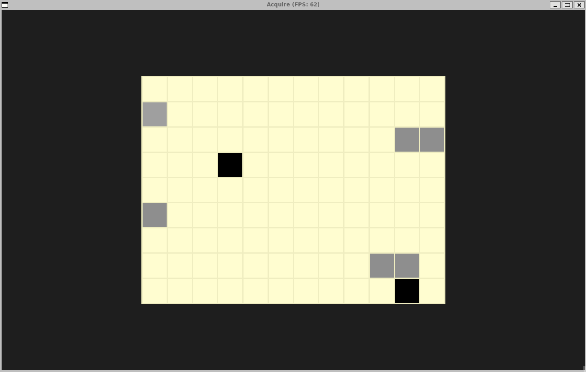

# Acquire

[Acquire](https://boardgamegeek.com/boardgame/5/acquire) is an old board game where players build hotel chains, buy stock, and complete mergers. At the end of the game, the player with the most money wins. This initial project implements the board where players can place tiles (hotels). Hotel chains, stock purchases, and mergers are not yet implemented.

The overall structure of this project is inspired by the [CppND-Capstone-Snake-Game](https://github.com/udacity/CppND-Capstone-Snake-Game) repo from [Udacity](https://www.udacity.com/).

## Dependencies
* cmake >= 3.7
  * All OSes: [click here for installation instructions](https://cmake.org/install/)
* make >= 4.1 (Linux, Mac), 3.81 (Windows)
  * Linux: make is installed by default on most Linux distros
  * Mac: [install Xcode command line tools to get make](https://developer.apple.com/xcode/features/)
  * Windows: [Click here for installation instructions](http://gnuwin32.sourceforge.net/packages/make.htm)
* SDL2 >= 2.0
  * All installation instructions can be found [here](https://wiki.libsdl.org/Installation)
  >Note that for Linux, an `apt` or `apt-get` installation is preferred to building from source. 
* gcc/g++ >= 5.4
  * Linux: gcc / g++ is installed by default on most Linux distros
  * Mac: same deal as make - [install Xcode command line tools](https://developer.apple.com/xcode/features/)
  * Windows: recommend using [MinGW](http://www.mingw.org/)

## Building and running

1. Clone this repo
2. Run `make` to build and run the application
3. Enter the number of players on the command line
4. Use the `space` key to cycle through a player's tiles
5. Use the `enter` key to place the selected tile and transition to the next player

## Code structure

### Control flow

### Class structure

### Tile state machine

## Udacity C++ capstone rubric
| Category | Criteria | Specifications | Implementation |
| --- | --- | --- | --- |
| Loops, Functions, I/O | The project demonstrates an understanding of C++ functions and control structures. | A variety of control structures are used in the project.    The project code is clearly organized into functions. | Project uses the `if`, `else if`, `else`, `switch`, `while`, and `for` control structures.    See the [Code structure](#code-structure) section of the README to see how the project is organized into functions. |
| Loops, Functions, I/O | The project accepts user input and processes the input. | The project accepts input from a user as part of the necessary operation of the program. | Users must input the number of players (see [here](https://github.com/EricSchrock/acquire/blob/main/src/main.cpp#L8-L9)). |
| Object Oriented Programming | The project uses Object Oriented Programming techniques. | The project code is organized into classes with class attributes to hold the data, and class methods to perform tasks. | Besides `main.cpp`, every source file contains a class declaration and/or definition.    Besides `main`, all functions are class methods. Besides a few constants (see [here](https://github.com/EricSchrock/acquire/blob/main/src/Tile.h#L5-L6)), all data is held in class attributes. |
| Object Oriented Programming | Classes use appropriate access specifiers for class members. | All class data members are explicitly specified as public, protected, or private. | All class members are explicitly marked `public` or `private`. |
| Object Oriented Programming | Class constructors utilize member initialization lists. | All class members that are set to argument values are initialized through member initialization lists. | See [here](https://github.com/EricSchrock/acquire/blob/main/src/Game.cpp#L4) and [here](https://github.com/EricSchrock/acquire/blob/main/src/Player.h#L8). |
| Object Oriented Programming | Classes encapsulate behavior. | Appropriate data and functions are grouped into classes. Member data that is subject to an invariant is hidden from the user. State is accessed via member functions. | Besides `main`, all functions are class methods.    All class attributes are `private`. Member functions gate all state changes. |
| Memory Management | The project makes use of references in function declarations. | At least two variables are defined as references, or two functions use pass-by-reference in the project code. | See [here](https://github.com/EricSchrock/acquire/blob/main/src/Controller.h#L5) and [here](https://github.com/EricSchrock/acquire/blob/main/src/Renderer.h#L13). |
